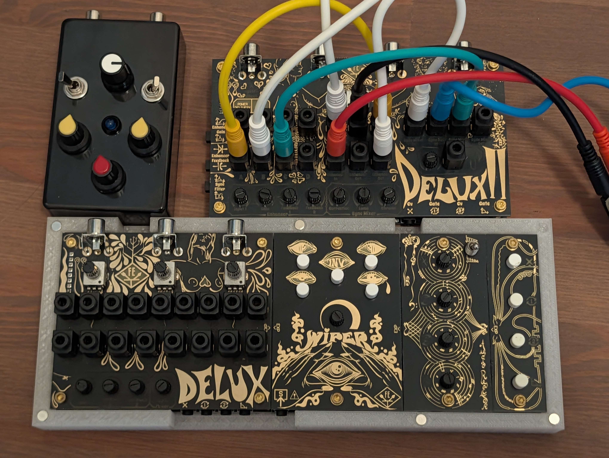
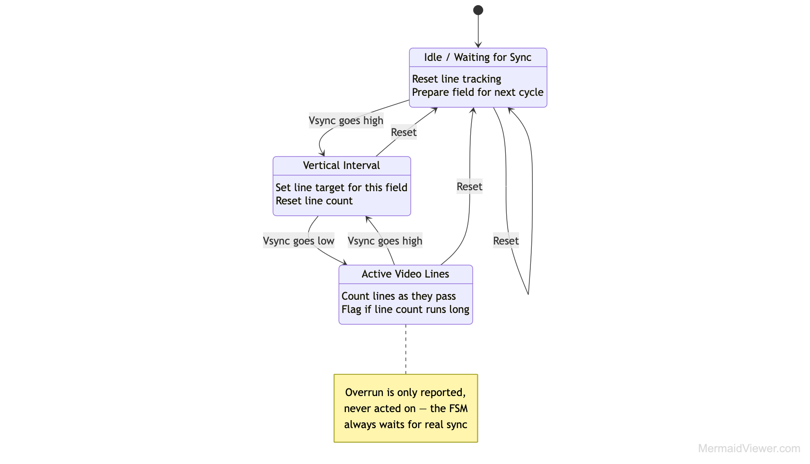
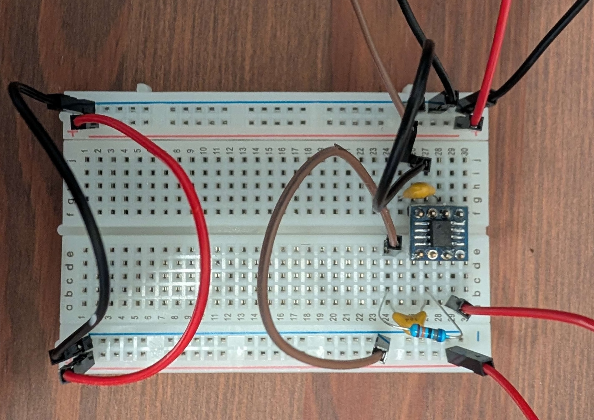
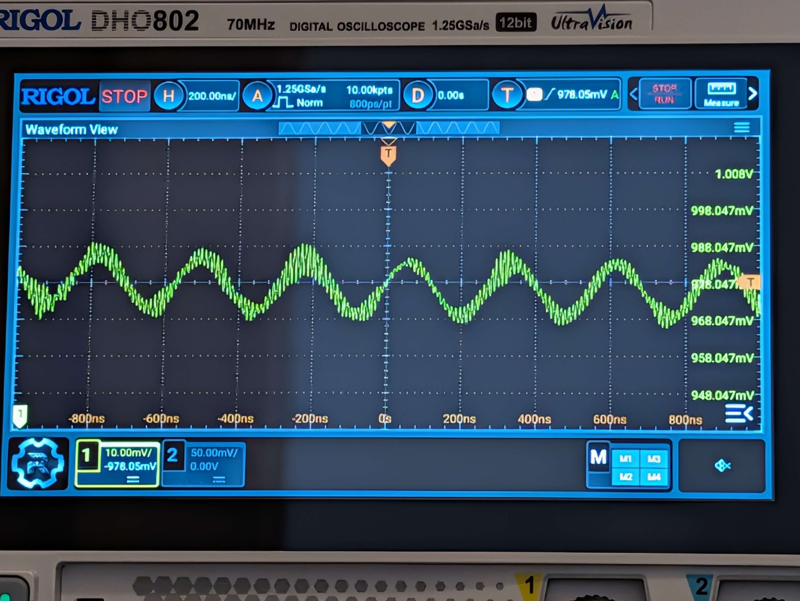
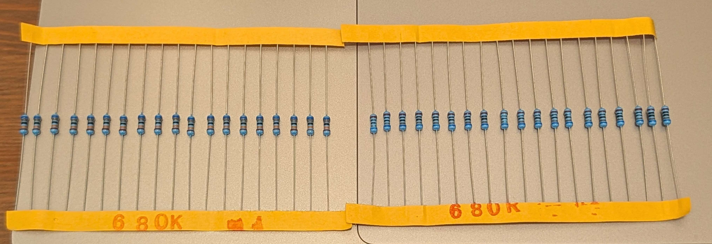
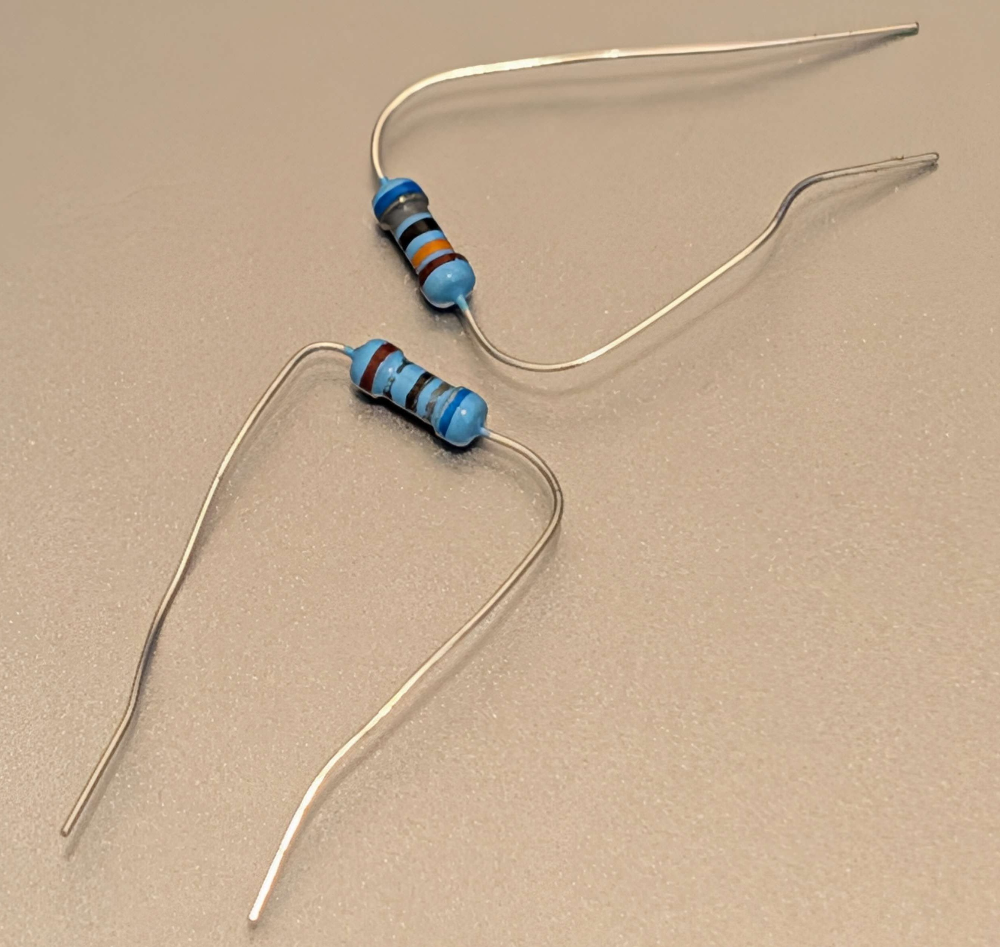
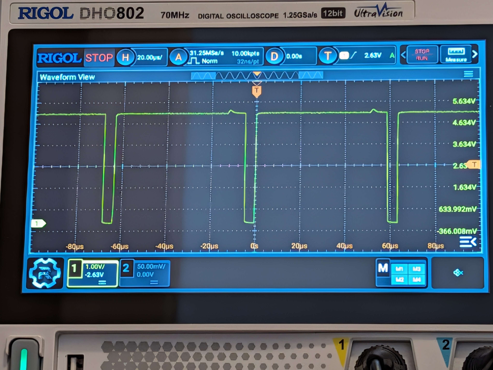

I have my (small) collection of glitch equipment that I use for my glitch art, but it's recently come to my attention that I don't _really_ need so many. That, and the NTSC standard has physical limitations specified such that those signal segments can only be distorted so much until they're unintelligible. So there's a limited number of ways that glitch equipment can mess with NTSC signals while still outputting visuals and not noise. And I got to thinking, well why not design my piece of hardware that uses an FPGA as the underlying hardware? So now I've begun building the XZF-1, named after the handle I post my art under.

To assist with this, I'm using the LM1881 Video Sync separator. This chip takes a composite video source such as NTSC video, and outputs information about the vertical sync, horizontal sync, odd/even field, burst/back porch timing, and the composite sync signal. By taking this derived sync information, I can decide how I want to distort the sync which will result in glitched video. 

The current FPGA portion of this, I've designed and implemented a simple FSM that takes the output of the LM1881 and uses it to track the current sync state of the video, all done in Verilog.

With granular tracking of the sync state by each vertical and horizontal phase, we're able to use this information in tandem with other physical components to create video distortions via the original video signal -- in place. Though that's TBA (to be assembled) and will be the subject of another post.

Now the breadboard portion of this. I was unable to procure an LM1881 in a DIP form factor --since it's obsolete. The only way to buy them would be in bulk but I really don't need 1000 of them. as much as I'd love to corner the sync separator market. Instead I had to get it in the SOIC form factor, which I then had to solder onto a breakout board to actually use it on a breadboard. 

That, along with some other breakout boards I had to solder for composite video input and USB power, left me with everything I needed to make sure the chip was functional. Though in my assembly, I ran into an issue with the vertical sync output being incredibly noisy, to the point where it was unusable.

After spending an hour probing the different outputs and confirming my assembly with the datasheet. I found the culprit, the allegedly 680k ohm resistor from my kit was not actually 680k ohms, and had been mislabeled. A quick crash course of 4-band resistor values and 15 minutes later, I found the correct resistor needed and fixed the issue. What was particularly confounding about this issue was the fact that the composite sync output was totally working as expected as far as I could see on my oscilloscope. 

The reason for this being, that the composite sync is directly derived from the video signal without any sort of processing, whereas vertical sync is one of the outputs that requires processing to derive. Having the wrong resistance connected to the Rset input was resulting in incorrect timing, and an unintelligible derived Vsync. 

Seeing as the FPGAs design has been programmed and unit tested, and the LM1881 is working as expected. The next steps are using my debugger and verifying the FPGA output, and then actually using that output to manipulate the video signal. More to come!
